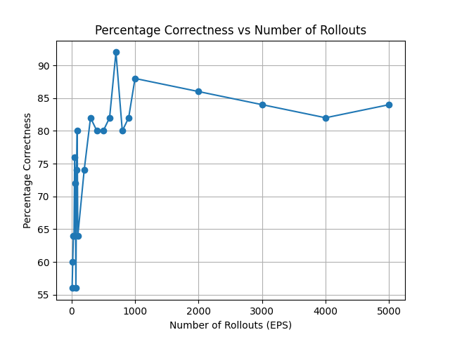

# NimMCTS

A Python implementation of Monte Carlo Tree Search (MCTS) algorithm for solving the game of Nim, along with Minimax and Alpha-Beta Pruning implementations for comparison.

## Project Overview

This project implements three different algorithms to solve the game of Nim:
1. Monte Carlo Tree Search (MCTS)
2. Minimax
3. Minimax with Alpha-Beta Pruning

The game of Nim is a mathematical game of strategy where two players take turns removing objects from distinct heaps. On each turn, a player must remove at least one object from exactly one heap. The goal is to be the player who removes the last object.

## Implementation Details

### Monte Carlo Tree Search
The MCTS implementation (`mcts.py` and `mcts_node.py`) includes:
- Tree node representation with state management
- UCT (Upper Confidence Bound for Trees) selection strategy
- Random rollout simulation
- Backpropagation of results

### Game State
The `NimPiles` class represents the game state with methods for:
- Finding valid moves (children nodes)
- Generating random moves for simulation
- Terminal state detection
- State comparison and hashing

## Performance Analysis

The MCTS algorithm's performance was evaluated over different numbers of rollouts. The graph below shows the percentage of correct moves made by the algorithm as the number of rollouts increases:



The analysis shows that:
- Performance improves significantly with more rollouts
- The algorithm achieves higher accuracy with increased exploration
- Diminishing returns appear after certain number of rollouts

## Usage

### Installation
```bash
git clone https://github.com/yourusername/NimMCTS.git
cd NimMCTS
```

### Running Tests
```python
# Run performance analysis
python tests_2.py

# Run game simulations
python tests_1.py
```

## Project Structure

- `mcts.py`: Core MCTS algorithm implementation
- `mcts_node.py`: Nim game state representation
- `minimax.py`: Minimax algorithm implementation
- `alphabetaprune.py`: Alpha-Beta pruning implementation
- `gamestate.py`: Game state utilities
- `gen.py`: Random game state generator
- `tests_1.py` & `tests_2.py`: Test and analysis scripts

## License

This project is licensed under the terms of the LICENSE file included in the repository.
